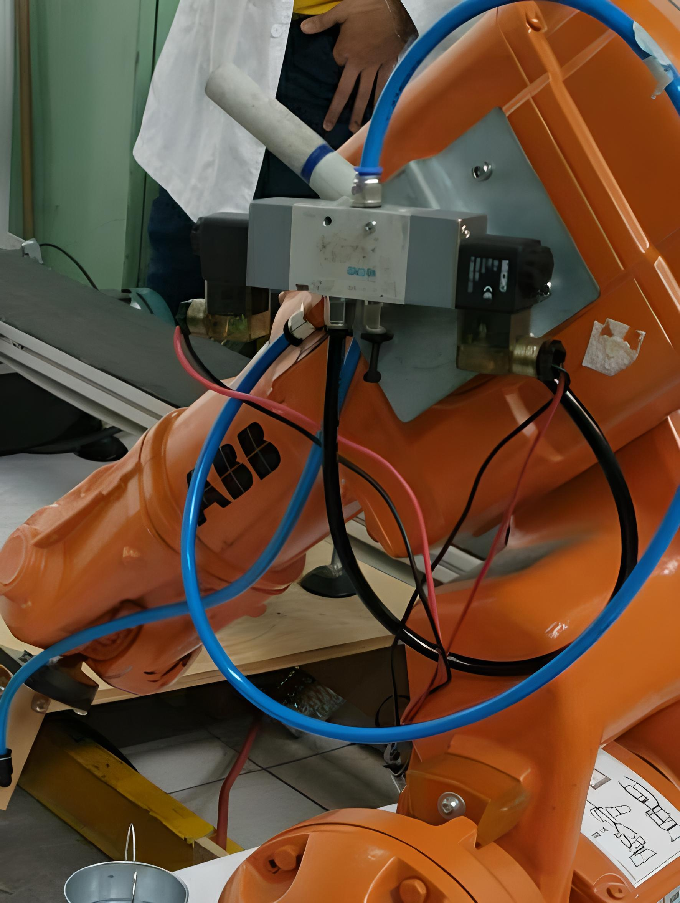

# Proyecto Final Robótica
### Integrantes: 
- Danilo Enrique Insuasty Delgado.
- Abraham Másmela Ramirez.
- Nicolás Prieto Solano.

## Objetivos:
• Desarrollo de un sistema robotizado para la automatización del proceso de Pick & Place y alistamiento de pedidos

## Consideraciones:
• El proceso de alistamiento: Se debe tomar el contenedor (balde) del extremo de la banda transportadora y
ubicarlo en un lugar de alistamiento. Se deben tomar 3 piezas distintas de la estantería de madera y ubicarlas
en el balde. El pedido listo (balde+piezas) debe ser ubicado de regreso sobre la banda transportadora.  
• Alistamiento de la estantería: La estantería de madera tiene 6 posiciones (A,B,C,D,E,F), se deben ubicar
6 piezas distintas en cada posición de la estantería. El tamaño, forma, material y demás características pueden
ser ajustadas de acuerdo a la herramienta diseñada. 
• Posicionamiento de los elementos: Tanto la estantería como las piezas en cada una de las 6 posiciones
pueden ser posicionadas al espacio de trabajo diestro del manipulador, todo ajuste se debe realizar con el
brazo inmóvil y solamente al inicio del proceso. 
• Análisis de tiempo manual: Se debe realizar pruebas de trabajo manual utilizando una sola mano, donde
se pueda identificar el tiempo promedio de alistamiento manual para las combinaciones estudiadas.  

## Diseño de la herramienta y modelos 3D:
En el diseño de la herramienta, se tomaron en cuenta las dimensiones de las piezas, el balde, la ventosa y el estante, para permitir la ejecución de las rutinas de manera eficiente. Se utilizó el software Inventor para modelar la herramienta y se consideró la opción de fabricarla mediante impresión 3D. Sin embargo, se determinó que para obtener una pieza más resistente y de mayor facilidad de construcción, se utilizarían láminas de MDF de 10mm cortadas con láser y pegadas con pegante Pl 285. Además, se realizaron cortes en las piezas que se colocarían en el estante utilizando diferentes formas geométricas. 

[Planos de corte de las piezas](https://github.com/DaniloI152/RoboticaProyectoFinal_Abraham_Danilo_Nicolas_2023/blob/main/Herramienta/Piezas2.pdf)  
[Planos de corte de Herramienta](https://github.com/DaniloI152/RoboticaProyectoFinal_Abraham_Danilo_Nicolas_2023/blob/main/Herramienta/plano%20corte.pdf)  
[Planos de porta Herramienta](https://github.com/DaniloI152/RoboticaProyectoFinal_Abraham_Danilo_Nicolas_2023/blob/main/Herramienta/porta%20herramienta.pdf)  
Se realizó el modelado del gancho y la ventosa para incorporarlos en la simulación del sistema. Para el gancho, se compró uno y se modelo con sus respectivas dimeniones. En el caso de la ventosa, se tuvieron en cuenta las dimensiones principales, como el diámetro y la altura, y se modeló como un cilindro. Además, se consideraron las dimensiones de las demás piezas, que tienen un grosor de 10 mm. Estas dimensiones se agregaron a la altura de la ventosa para simplificar la colocación de los modelos 3D en la simulación, al incluir esta dimensión adicional en la ventosa, se aseguró que la pieza estuviera presente en todo momento, lo que permitió verificar que las trayectorias se realizaran sin colisiones. Esta aproximación facilitó el análisis y la validación del sistema en la simulación.  

Para el modelado de la banda se tomaron sus dimensiones de altura, ancho y largo y se reprensetó como un prisma rectangular 

[Planos de la banda](https://github.com/DaniloI152/RoboticaProyectoFinal_Abraham_Danilo_Nicolas_2023/blob/main/Herramienta/banda.pdf)

Se procedio a hacer lo mismo con el estante donde irán posicionadas las piezas

[Planos del estante](https://github.com/DaniloI152/RoboticaProyectoFinal_Abraham_Danilo_Nicolas_2023/blob/main/Herramienta/estante.pdf)

## Implementación de las señales digitales
Para implementar las señales digitales para la instalación y control de la válvula fue necesario abrir el tablero que acompaña al manipulador, donde revisando una de las conexiones hacia un bombillo que se controla por las salidas digitales del robot se obtiene la ubicación dentro de la bornera donde se ubicaría la tierra, con este nodo ubicado se probaron distintos puntos de la bornera con la salida digital 1 y 2 abiertas para comprobar en cuál de estas el voltaje es de 24 V, con las salidas ya ubicadas se insertan los cables de los motores de la válvula dentro del tablero y se realizan las conexiones respectivas para que las salidas controlen el estado de la válvula 5/2, donde la salida 1 se encarga de cerrar el flujo de aire y la salida 2 abrirá el flujo de aire.

Para la instalación de la válvula se montó esta sobre una placa que a su vez está montada en el robot, el suministro neumático proviene del robot que está conectado al suministro neumático del propio laboratorio, para convertir el aire en vacío se conecta la salida de la válvula a la entrada de un generador de vacío que se encarga de hacer la fuerza de succión de la ventosa, esta parte también se coloca en la placa de montaje pegada al robot, finalmente se conecta la salida del generador a la entrada de la ventosa que está colocada en la herramienta.

## Robot Studio

Para implementar los modelos en el espacio de trabajo y llevar a cabo la simulación, se tomaron mediciones de las posiciones relativas de los elementos con respecto a los centros del robot. Se observó que las divisiones en el suelo del laboratorio coincidían con las divisiones representadas en el entorno de Robot Studio. Utilizando estas medidas, se ubicaron los elementos en las posiciones adecuadas para realizar la simulación. Este proceso permitió una representación precisa del entorno y aseguró que la simulación reflejara fielmente la disposición física de los elementos en el laboratorio.

Con el fin de garantizar la generación precisa de las trayectorias y evitar la necesidad de correcciones en la implementación en el robot real, se llevó a cabo una prueba manual. Durante esta prueba, se identificaron posibles problemas y obstáculos que podrían surgir durante la ejecución de las trayectorias. Esta información se utilizó para realizar ajustes y correcciones en la simulación, de manera que las trayectorias generadas fueran óptimas y las orientaciones de la herramienta se definieran de manera adecuada para llevar a cabo el proceso de forma correcta. Como resultado de esta prueba, se obtuvo una comprensión clara de las trayectorias a implementar y las orientaciones requeridas, lo que facilitó una implementación exitosa en el robot real.

### Simulación

En la implementación de los elementos en el espacio de trabajo del robot en Robot Studio, se asignó a cada uno de ellos un "workobject". Cada workobject contiene una serie de puntos estratégicamente ubicados que servirán como referencia para la construcción de las trayectorias en la rutina. Estos puntos se definen con el propósito de garantizar un posicionamiento preciso y adecuado de la herramienta del robot en relación con los elementos a manipular. Al crear y asignar estos workobjects, se establece una estructura organizada y coherente que facilita la generación de las trayectorias de manera eficiente y precisa durante la programación y simulación del robot.

Como se observa, se tienen puntos para el agarre del balde en la banda y en el piso, también se crean puntos asociados al estante para tomar cada una de las piezas, además, se han incluido puntos adicionales que se encuentran alejados de los elementos mencionados, pero que forman parte del workobject del robot. Estos puntos adicionales tienen como objetivo asegurar transiciones fluidas y seguras entre las diferentes trayectorias, evitando posibles colisiones durante el movimiento del robot.  

Se han definido un total de nueve trayectorias distintas para el proceso de manipulación. Seis de estas trayectorias corresponden a cada una de las piezas, y han sido diseñadas de manera que el robot se aproxime al frente del estante de forma lineal. Posteriormente, el robot sigue la trayectoria establecida para acercar la ventosa verticalmente a la pieza. A continuación, se envía una señal de pulso a la salida digital 2 para activar la succión de la ventosa y asegurar la sujeción de la pieza. Luego, se realiza la misma trayectoria en sentido inverso para alejar la herramienta con la pieza sujeta con la ventosa.

Después, el robot se dirige hacia el balde ubicado en el piso. En este punto, se espera durante dos segundos y se envía un pulso a la salida digital 1 para desactivar la succión de la ventosa, permitiendo que la pieza caiga dentro del balde. (Nombre de las trayectorias: PiezaA, PiezaB, PiezaC, PiezaD, PiezaE y PiezaF)

Las tres trayectorias corresponden a:  
Un punto incial para tener la posicion de home del robot y poder llevarlo a esta posición en cualquier momento. (Nombre de la trayectoria: Pinicial)  

La trayectoria de la toma del balde de la banda y dejarlo en el piso (Nombre de la trayectoria: Balde)

La trayectoria final de tomar el balde del piso despues de haber dejado las piezas dentro de el y llevarlo a la banda transportadora (Nombre de la trayectoria: Fin)

Ya con las trayectorias creadas solo se debian crear las rutinas organizandolas en el código.

### Código

En el código implementado, se han desarrollado cuatro procesos para la ejecución de las rutinas que contienen 4 configuraciones de piezas diferentes , estos procesos internamente están organizados de manera secuencial, siguiendo una estructura bien definida.

En primer lugar se lleva el robot a la posición de "home" o posición inicial (Pinicial), una vez alcanzada esta posición, el siguiente paso es tomar el balde de la banda transportadora y depositarlo en el piso (Balde).

Luego se encarga de recoger tres piezas diferentes y depositarlas en el balde ubicado en el piso (Pieza_). Para ello, se ejecutan las rutinas de trayectorias correspondientes de forma secuencial, asegurando el correcto posicionamiento y sujeción de cada pieza antes de depositarla en el balde.

Posteriormente, se transporta el balde desde el piso hasta la banda transportadora (Fin), finalmente, se regresa el robot a la posición de "home" una vez completadas todas las tareas anteriores (Pinicial), esta posición de "home" sirve como referencia para futuras operaciones y permite que el robot esté listo para realizar nuevas tareas.

Dentro de las rutinas de cada una de las piezas, se configura la activación de las dos salidas digitales por medio de pulsos y una espera de 2 segundos; ya que todas tienen la misma estructura de código, con igual número de ejecución de trayectorias, solo que poseen diferentes configuraciones articulares para poder llegar a las diferentes posiciones en el estante, por lo tanto, se tendrá la siguiente estructura:

Se realiza la implementación de una HMI en el flex pendant que fue creada por medio de Screen Maker de robotstudio, donde se tiene un boton marcha para dar inicio a la rutina, un led de indicación que finalizó la rutina, una descripción de las diferentes configfuraciones de selección de las piesas, un selector para las 4 configuraciones y una imagen que muestra la disposición de las piezas en el estante.

El primer paso del código consiste en llevar al robot a su posición de "home" inicial. Esta posición proporciona una referencia fija para las operaciones subsiguientes.

Después de alcanzar la posición de "home", se espera a que la salida digital "Ini" esté activa utilizando la función WaitDO. Esta espera garantiza que todas las condiciones necesarias estén listas antes de continuar con la ejecución.

Se apaga el LED asociado a la salida digital para asegurarse de que no esté encendido previamente y no interfiera con las siguientes operaciones.

Utilizando la función CallByVar, llama a un procedimiento mediante una variable en este caso el procedimeinto "C#". Esta selección determina una de las cuatro configuraciones de piezas disponibles, identificadas como los procesos C1, C2, C3 y C4. La variable "C#" se utiliza posteriormente en el proceso "sele" para verificar qué configuración ha sido seleccionada.

Dentro del proceso "sele", se utilizan estructuras condicionales (IF) para verificar qué configuración de piezas ha sido seleccionada. Dependiendo de "C#", se ejecutará la rutina correspondiente.

Una vez finalizada la rutina seleccionada, se enciende el LED asociado a la salida digital 3 para indicar que la rutina ha concluido exitosamente.
Se define la variable selesctor como PERS num, para que permita la modificación con la HMI.

## Resultados

## Análisis de tiempos

### Proceso manual
### Proceso automático con el robot

## Conclusiones
• El modelado completo del espacio de trabajo es crucial para el éxito del desarrollo del proyecto. Aunque se crean planos que indican la ubicación de los elementos y se generan modelos en 3D con dimensiones precisas, al probar las rutinas nos encontramos con la situación de que las piezas habían sido cambiadas de posición, lo que requería actualizar las posiciones. Para abordar este problema de manera sencilla, se estableció una vinculación entre cada punto de las trayectorias y las piezas correspondientes. De esta forma, al mover la pieza a su ubicación correcta, las trayectorias se ajustaban automáticamente en consecuencia.
• En futuros trabajos, se tiene la intención de llevar a cabo la implementación del HMI (Interfaz Hombre-Máquina) en el flex pendant del laboratorio. Aunque en este proyecto en particular no se logró llevar a cabo la implementación en el robot real, se pudo realizar y probar exitosamente en el entorno de simulación. La implementación del HMI en el flex pendant ofrecerá numerosas ventajas en términos de control y operación del robot. A pesar de no haberse implementado la HMI en el robot real, el proyecto se desarrolló de manera exitosa sin esta funcionalidad. Se logró alcanzar los objetivos planteados y se obtuvieron resultados satisfactorios. La simulación fue una herramienta valiosa que permitió evaluar y validar el rendimiento del sistema en ausencia de la HMI.
